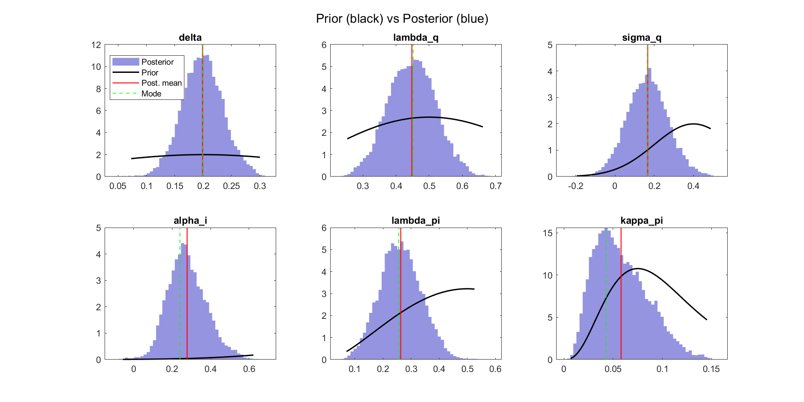

# The AU-PAC Model: A Semi-Structural Macroeconomic Model for Australia

## David Stephan

### April 2026

---

## Abstract

This paper presents AU-PAC, a semi-structural macroeconomic model for Australia adapted from the FR-BDF model of the Banque de France (Lemoine et al., 2019). Following the FRB/US modeling tradition, the model combines Polynomial Adjustment Costs (PAC) with explicit expectations and a well-defined supply block based on CES technology. AU-PAC contains 140 endogenous variables, 47 exogenous shocks, and 256 parameters, with five PAC behavioral equations governing value-added prices, consumption, business investment, household investment, and employment. Expectations are formed using an enriched 12-equation satellite VAR model (E-SAT) that feeds into a var_model companion matrix for PAC h-vector computation. The model is estimated on Australian quarterly data from 1993Q1 to 2024Q4 using three complementary approaches: equation-by-equation Bayesian MCMC for the E-SAT core, iterative OLS with Kalman-smoothed auxiliary variables for the five PAC equations, and full-system Bayesian mode-finding for 27 joint parameters (log marginal density: -972.75). Under a three-regime comparison following FR-BDF Section 6, model-consistent expectations attenuate monetary policy transmission by 30-89% relative to backward-looking expectations, with housing investment showing the strongest attenuation (83%). Australia-specific features include an endogenous Taylor rule for the RBA, variable-rate mortgage transmission, commodity price channels, and the US as the foreign bloc. The model is implemented in Dynare 6.5 with MATLAB R2019a.

**Keywords**: Semi-structural model, polynomial adjustment costs, expectations, monetary policy transmission, Australian economy

**JEL codes**: C51, C54, E17, E37, E52

---

## Non-Technical Summary

Central banks require macroeconomic models that can capture the key transmission channels of monetary policy while remaining flexible enough for scenario analysis and forecasting. AU-PAC fills this role for the Australian economy by adapting the well-established FR-BDF framework from the Banque de France.

The model works as follows. Five key macroeconomic variables --- value-added prices, consumption, business investment, household investment, and employment --- are determined by error-correction equations that balance adjustment toward long-run targets against the costs of rapid change. Agents form expectations about future economic conditions using a small satellite forecasting model (E-SAT), and these expectations directly influence current decisions. The model also includes a detailed financial block (term structure, credit spreads, exchange rate), a trade block, and demand deflators, all linked through a GDP identity that feeds back into the core IS curve.

We estimate the model on 30 years of Australian data (1993-2024) using Bayesian and classical methods. The estimation reveals that Australian consumption is highly sensitive to interest rates, that wage persistence is lower than commonly calibrated, and that COVID-era outliers significantly distort standard estimation without explicit dummy treatment.

A key finding is that the form of expectations matters greatly for monetary policy transmission. When agents use backward-looking forecasts, a monetary tightening produces a peak output decline of -0.024%. When agents use fully forward-looking (model-consistent) expectations, the same shock produces only -0.020% --- a 20% attenuation for output, rising to 83-89% for investment and employment. This differential, consistent with the FR-BDF findings for France, highlights the importance of modeling expectations explicitly.

The model is available as open-source Dynare code and can be used for policy scenario analysis, conditional forecasting, and research on Australian monetary transmission.

---

## Table of Contents

1. [Introduction](#1-introduction)
2. [Bird's-Eye View of the Model](#2-birds-eye-view)
3. [Expectation Formation and the PAC Framework](#3-expectation-formation-and-the-pac-framework)
4. [Model Specification](#4-model-specification)
5. [Estimation](#5-estimation)
6. [Model Properties](#6-model-properties)
7. [Conclusion](#7-conclusion)
8. [Australia-Specific Features](#8-australia-specific-features)
- [Appendix A: Complete Variable List](#appendix-a-complete-variable-list)
- [Appendix B: Complete Shock List](#appendix-b-complete-shock-list)
- [Appendix C: Growth Neutrality Proofs](#appendix-c-growth-neutrality-proofs)
- [Appendix D: h-Vector Decomposition](#appendix-d-h-vector-decomposition)
- [Appendix E: Complete Parameter List](#appendix-e-complete-parameter-list)
- [References](#references)

---

## 1. Introduction

AU-PAC is the Australian adaptation of the FR-BDF semi-structural model developed by the Banque de France for the French economy (Lemoine et al., 2019, Working Paper #736). The model belongs to the FRB/US family of semi-structural models used at central banks worldwide, including MUSE at the Bank of Canada, LENS at the Bank of England, and ECB-Base at the European Central Bank. These models occupy a middle ground between reduced-form VARs (which lack structural interpretation) and full DSGE models (which impose strong theoretical restrictions): behavioral equations are derived from optimization with adjustment costs, but the supply block and financial channels are specified semi-structurally.

Three features are central to the modeling approach:

1. **Explicit expectations.** Agents form expectations about future economic conditions using either a backward-looking satellite VAR model (E-SAT) or model-consistent forward-looking expectations. The choice of expectation regime has first-order effects on monetary policy transmission.

2. **Polynomial adjustment costs.** Non-financial behavioral equations are derived from agents minimizing costs of deviating from long-run targets subject to polynomial adjustment costs, yielding error-correction equations augmented with the present value of expected future target changes.

3. **Well-defined supply block.** A CES production function with labor-augmenting technical progress determines long-run output and provides consistent targets for employment, investment, and value-added prices through factor demand conditions.

### Table 1.1: Key differences from FR-BDF

Australia differs from France in several economically important ways reflected in the model:

| Feature | France (FR-BDF) | Australia (AU-PAC) |
|---------|----------------|-------------------|
| Monetary policy | Exogenous (ECB sets rates) | Endogenous Taylor rule (RBA) |
| Foreign bloc | Euro area | United States |
| Exchange rate regime | Fixed within eurozone | Floating AUD/USD |
| Inflation target | 1.9% (ECB) | 2.5% (RBA midpoint) |
| Short-term rate | 3-month Euribor | RBA cash rate (~4.2% mean) |
| Mortgage structure | Mixed fixed/variable | Predominantly variable-rate |
| Commodity exposure | Low | High (mining exports) |

### Table 1.2: Model dimensions

| Dimension | AU-PAC | FR-BDF (approx.) |
|-----------|--------|-------------------|
| Endogenous variables | 140 | ~130 |
| Exogenous shocks | 47 (incl. 2 COVID dummies) | ~40 |
| Parameters | 256 | ~200 |
| PAC equations | 5 | 5 |
| var_model equations | 12 | — (embedded in TCM) |
| Forward-looking variables (hybrid) | 3 | 3 |
| Forward-looking variables (MCE) | 30 | ~30 |
| Estimation sample | 1993Q1-2024Q4 (128 quarters) | 1990Q1-2017Q4 |

### Software

- Dynare 6.5 with native `pac_expectation()` and `var_model` support
- MATLAB R2019a
- Model files: `au_pac.mod` (hybrid), `au_pac_var.mod` (VAR-based), `au_pac_mce.mod` (full MCE)
- GitHub: https://github.com/DavidAStephan/AUSPAC

### Paper outline

Section 2 provides a bird's-eye view of the model structure and transmission channels. Section 3 develops the expectation formation framework and PAC microfoundations. Section 4 specifies all model equations block by block, with coefficient tables for each. Section 5 describes the estimation strategy and results. Section 6 analyzes model properties including monetary policy transmission under three expectation regimes, impulse responses to all shocks, conditional forecasting, and the forward guidance experiment. Section 7 concludes. Section 8 discusses Australia-specific features. Five appendices provide complete variable, shock, parameter, growth neutrality, and h-vector tables.

---

## 2. Bird's-Eye View

### 2.1 Model structure

AU-PAC is organized into interconnected blocks, with expectations playing a role in most behavioral equations:

```
SUPPLY BLOCK                    NOMINAL BLOCK
- CES production function       - Wage Phillips curve (fwd PV of u_gap)
- Capital accumulation          - VA price: CES unit cost dual (PAC)
- Employment target             - Demand deflators: ECM equations
- TFP process                   - User cost of capital
         |                               |
         v                               v
    EXPECTATIONS              DEMAND BLOCK
    E-SAT (12-eq VAR)        - Consumption: permanent income PV (PAC)
    or Model-consistent       - Business investment: CES user cost (PAC)
    (MCE)                     - Household investment: mortgage rate (PAC)
         |                    - Employment: 4th-order labor hoarding (PAC)
         v                               |
FINANCIAL BLOCK                          v
- Term structure (PV of i)    TRADE BLOCK
- WACC (3 components)         - Exports ECM (world demand + commodities)
- Exchange rate (UIP)         - Imports ECM (IAD weights)
- Bank lending rates
         |                    GOVERNMENT + IDENTITY
         v                    - Fiscal rule (countercyclical)
    Feedback loops            - GDP expenditure identity
    (bridge equation)         - Bridge to IS curve (lambda_dom = 0.40)
```

*Figure 2.1: Model block diagram. Variables directly affected by expectations appear throughout: the 5 PAC equations, the term structure, exchange rate, wage Phillips curve (PV of unemployment), and the consumption target (PV of permanent income).*

### 2.2 Expectation regimes

The model can be solved under three expectation regimes, following FR-BDF Section 6:

### Table 2.1: Three expectation regimes

| Regime | Financial expectations | Non-financial expectations | Forward vars | File |
|--------|----------------------|--------------------------|-------------|------|
| **VAR-based** | Backward (AR(1) policy functions) | Backward (PAC h-vectors from var_model) | 0 | `au_pac_var.mod` |
| **Hybrid** | Forward (pv_i, pv_u_gap, pv_yh) | Backward (PAC h-vectors from var_model) | 3 | `au_pac.mod` |
| **Full MCE** | Forward (all leads) | Forward (pac_expectation expands to leads) | 30 | `au_pac_mce.mod` |

Under the hybrid regime (the baseline), the 5 PAC expectations use backward h-vectors from the enriched var_model companion matrix, while the term structure, unemployment, and permanent income present values use forward-looking recursive forms. Under full MCE, all expectations are forward-looking.

### 2.3 Key transmission channels

### Table 2.2: Monetary policy transmission channels

| Channel | Mechanism | Key equations | Key parameters |
|---------|-----------|---------------|----------------|
| Interest rate | Short rate -> 10Y yield -> WACC -> user cost -> business investment | eqs (48)-(50), (55) | kappa_10=0.97, sigma_ces=0.53 |
| Exchange rate | Short rate -> UIP -> AUD appreciation -> exports/imports | eq (54) | alpha_s=0.15, b3_x=0.10 |
| Mortgage | Short rate -> 10Y yield -> bank lending -> housing investment | eqs (56), (38) | spread_lh=0.40, kappa_mort=0.048 |
| Expectations | Short rate enters E-SAT -> all h-vectors shift | var_model block | All a_X_Y auxiliary params |
| Wage-price | Output gap -> unemployment PV -> wages -> ULC -> VA price | eqs (30), (28), (29) | kappa_w=0.238, gamma_ulc=0.12 |
| Permanent income | Output gap -> PV of future income -> consumption target | eqs (33), (34) | beta_c=0.95, kappa_inc=0.050 |

---

## 3. Expectation Formation and the PAC Framework

### 3.1 The E-SAT expectation satellite model

The Expectation SATellite model (E-SAT) is a structural VAR with 11 core equations. Agents with limited information form expectations by forecasting from this small model. The core equations relate the Australian output gap, inflation, and interest rate to their US counterparts:

**Australian IS curve** (eq. 1):

$$\hat{y}_t = \lambda_q \hat{y}_{t-1} + \delta \hat{y}^{US}_t - \sigma_q (i_{t-1} - \bar{i}_{t-1} - \pi^{gap}_{t-1}) + \lambda_{dom} \hat{y}^{dom}_t + \varepsilon^q_t$$

**Australian Phillips curve** (eq. 2):

$$\pi^{gap}_t = \lambda_\pi \pi^{gap}_{t-1} + \kappa_\pi \hat{y}_{t-1} + \varepsilon^\pi_t$$

**Taylor rule** (eq. 3):

$$i^{gap}_t = \lambda_i i^{gap}_{t-1} + (1-\lambda_i)(\alpha_i \pi^{gap}_{t-1} + \beta_i \hat{y}_{t-1}) + \varepsilon^i_t$$

**US IS curve** (eq. 4): $\hat{y}^{US}_t = \lambda_{q,US} \hat{y}^{US}_{t-1} + \varepsilon^{q,US}_t$

**US Phillips curve** (eq. 5): $\pi^{gap,US}_t = \lambda_{\pi,US} \pi^{gap,US}_{t-1} + \kappa_{\pi,US} \hat{y}^{US}_{t-1} + \varepsilon^{\pi,US}_t$

Plus three anchor equations (eqs. 6-8) for the long-run interest rate, AU inflation target, and US inflation target, each following AR(1) processes toward steady state.

#### Bayesian estimation

E-SAT was estimated using Bayesian methods (Metropolis-Hastings, 50,000 draws, 2 chains) on quarterly Australian data from 1993Q1 to 2024Q4.

### Table 3.1: E-SAT posterior estimates

| Parameter | Description | Prior | Posterior mean | FR-BDF |
|-----------|-------------|-------|---------------|--------|
| delta | AU-US demand spillover | Beta(0.20, 0.10) | 0.199 | — (EA bloc) |
| lambda_q | AU output gap persistence | Beta(0.50, 0.15) | 0.448 | 0.877 |
| sigma_q | Real rate sensitivity | Gamma(0.20, 0.10) | 0.166 | 0.072 |
| lambda_i | Taylor rule inertia | Beta(0.80, 0.05) | 0.828 | 0.891 |
| alpha_i | Taylor rule inflation weight | Normal(0.30, 0.15) | 0.279 | 0.390 |
| beta_i | Taylor rule output weight | Normal(0.15, 0.10) | 0.135 | 0.156 |
| lambda_pi | AU inflation persistence | Beta(0.30, 0.10) | 0.263 | 0.465 |
| kappa_pi | Phillips curve slope | Gamma(0.06, 0.03) | 0.058 | 0.080 |
| lambda_q_us | US output gap persistence | Beta(0.80, 0.10) | 0.806 | — |
| lambda_pi_us | US inflation persistence | Beta(0.65, 0.10) | 0.653 | — |
| kappa_pi_us | US Phillips slope | Gamma(0.02, 0.01) | 0.013 | — |

Convergence confirmed by Geweke tests (all p > 0.10) and Brooks-Gelman diagnostics. Acceptance rates: 46.1-46.3%.

### Table 3.2: Steady-state values

| Variable | SS value (quarterly) | Annual equivalent | Description |
|----------|---------------------|-------------------|-------------|
| i_ss | 1.049% | ~4.2% | RBA neutral rate |
| pi_ss_au | 0.625% | ~2.5% | RBA inflation target midpoint |
| pi_ss_us | 0.500% | ~2.0% | Fed inflation target |

#### Companion matrix

The E-SAT model can be written in structural VAR form $AZ_t = BZ_{t-1} + \varepsilon_t$, yielding the reduced form $Z_t = HZ_{t-1} + \eta_t$ where $H = A^{-1}B$. The $i$-step-ahead forecast is $Z^e_{t+i} = H^i Z_t$, enabling computation of discounted present values of any variable.

### 3.2 Enriched E-SAT: the var_model architecture

A key innovation in AU-PAC is the enlargement of the E-SAT state vector with auxiliary equations for each PAC target variable. Following FR-BDF Tables 4.4.4, 4.5.7, 4.6.3-4, 4.6.11-12, and 4.6.16, these auxiliary equations capture how the macro state (output gap, interest rate gap, inflation gap, unemployment gap) feeds into each target variable's dynamics.

The enriched system is declared as a single `var_model` in Dynare:

```
var_model(model_name = esat_enriched,
    eqtags = ['var_y', 'var_i', 'var_pi',           // 3 E-SAT core
              'var_u', 'var_yus',                     // 2 additional states
              'var_pQ', 'var_n', 'var_yh', 'var_c',   // 4 auxiliary gaps
              'var_ib', 'var_rKB', 'var_ih']);          // 3 auxiliary gaps
```

All 5 PAC equations share this enriched var_model for h-vector computation.

### Table 3.3: Enriched var_model equations (12x12 companion matrix)

| # | Tag | Variable | Equation type | FR-BDF ref |
|---|-----|----------|--------------|------------|
| 1 | var_y | y_gap_var | IS curve (lagged) | E-SAT eq 1 |
| 2 | var_i | i_gap_var | Taylor rule (lagged) | E-SAT eq 3 |
| 3 | var_pi | pi_gap_var | Phillips curve (lagged) | E-SAT eq 2 |
| 4 | var_u | u_gap_var | Okun's law | Table 4.5.2 |
| 5 | var_yus | yhat_us_var | US IS (AR(1)) | E-SAT eq 4 |
| 6 | var_pQ | piQ_hat | VA price auxiliary | Table 4.4.4 |
| 7 | var_n | n_hat | Employment auxiliary | Table 4.5.7 |
| 8 | var_yh | yh_ratio_hat | Income-output ratio | Table 4.6.3 |
| 9 | var_c | c_hat | Consumption PV^2 | Table 4.6.4 |
| 10 | var_ib | ib_hat | Business inv output gap | Table 4.6.11 |
| 11 | var_rKB | rKB_hat | Business inv user cost | Table 4.6.12 |
| 12 | var_ih | ih_hat | Housing inv target | Table 4.6.16 |

### Table 3.4: Auxiliary equation coefficients

Each auxiliary equation takes the form: $\hat{X}_t = \rho_X \hat{X}_{t-1} + a_{X,y} \hat{y}_{t-1} + a_{X,i} \tilde{i}_{t-1} + a_{X,\pi} \tilde{\pi}_{t-1} + a_{X,u} \tilde{u}_{t-1} + ...$

| Auxiliary | Own lag (rho) | y_gap | i_gap | pi_gap | u_gap | Other | FR-BDF ref |
|-----------|--------------|-------|-------|--------|-------|-------|------------|
| piQ_hat | 0.70 | 0.03 | -0.02 | 0.01 | -0.05 | — | Table 4.4.4 |
| n_hat | **0.67** | 0.12 | -0.03 | 0.05 | -0.04 | — | Table 4.5.7 |
| yh_ratio_hat | **0.92** | 0.32 | — | — | -0.08 | — | Table 4.6.3 |
| c_hat | 0.60 | 0.06 | -0.04 | 0.01 | -0.03 | a_c_yh=0.39 | Table 4.6.4 |
| ib_hat | **0.59** | 0.15 | — | 0.04 | -0.02 | — | Table 4.6.11 |
| rKB_hat | 0.55 | — | 0.24 | — | — | — | Table 4.6.12 |
| ih_hat | **0.71** | 0.08 | -0.08 | 0.05 | -0.03 | — | Table 4.6.16 |

**Bold** values match FR-BDF exactly. The persistence parameters for employment (0.67), income-output ratio (0.92), business investment (0.59), and housing investment (0.71) are taken directly from the corresponding FR-BDF auxiliary equation estimates.

### 3.3 PAC microfoundations

The PAC framework derives behavioral equations from agents minimizing a cost function that penalizes deviations from a target $y^*_t$ and $m$ differences of the decision variable $y_t$:

$$C_t = \sum_{i=0}^{\infty} \beta^i \left[(y_{t+i} - y^*_{t+i})^2 + \sum_{k=1}^{m} b_k ((1-L)^k y_{t+i})^2\right]$$

The first-order condition yields an error-correction equation (eq. 9):

$$\Delta y_t = a_0 (y^*_{t-1} - y_{t-1}) + \sum_{k=1}^{m-1} a_k \Delta y_{t-k} + \sum_{i=0}^{\infty} d_i \Delta y^*_{t+i}$$

where $a_0$ is the error-correction speed, $a_k$ are AR lag coefficients, and $\omega = \sum d_i$ is the share of nonstationary expectations. **Growth neutrality** requires $1 - \sum a_k - \omega = 0$ on the balanced growth path.

Under VAR-based expectations, the infinite sum collapses to $k_0 Z_{t-1}$ where $k_0$ is the h-vector computed from the var_model companion matrix. Dynare's `pac_expectation()` command automates this computation.

### Table 3.5: PAC equation specifications

| Equation | Order m | AR lags | Discount beta | h-vector sum | Manual omega | Amplification |
|----------|---------|---------|---------------|-------------|-------------|---------------|
| VA price | 1 | 1 | 0.98 | 0.452 | 0.46 | 1.0x |
| Consumption | 1 | 1 | 0.98 | 0.678 | 0.369 | **1.84x** |
| Business inv | 2 | 2 | 0.98 | 0.501 | 0.350 | **1.43x** |
| Household inv | 2 | 2 | 0.98 | 0.569 | 0.300 | **1.90x** |
| Employment | 4 | 4 | 0.98 | 0.446 | 0.300 | **1.49x** |

The 1.4-1.9x amplification confirms the FR-BDF Section 6 finding that forward expectations amplify monetary transmission.

### 3.4 Three expectation regimes

Under **VAR-based** expectations, `pac_expectation()` evaluates to $k_0 Z_{t-1}$, a linear function of the lagged var_model state vector. All dynamics are backward-looking.

Under the **Hybrid** regime, PAC equations remain backward-looking but three financial/labor variables use forward-looking recursive forms: the term structure ($pv_i$), the present value of unemployment gaps ($pv_{u,gap}$), and permanent income ($pv_{yh}$).

Under **full MCE**, `pac_expectation()` expands into forward-looking recursive leads of the target variable (FR-BDF eqs 138-142). The MCE version has 30 forward-looking variables compared to 3 under the hybrid regime.

---

## 4. Model Specification

### 4.1 Notation

| Prefix/Suffix | Meaning | Example |
|---------------|---------|---------|
| `dln_` | Log difference (quarterly growth rate) | `dln_c` = consumption growth |
| `_gap` | Deviation from target/trend | `i_gap` = i_au - ibar |
| `_star` | Target/desired value | `dln_c_star` = target consumption growth |
| `_bar` | Trend/long-run anchor | `pibar_au` = LR inflation anchor |
| `pi_` | Inflation rate | `piQ` = VA price inflation |
| `s_` | Spread | `s_COE` = equity spread |
| `pv_` | Present value of expectations | `pv_u_gap` = PV of future unemployment gaps |
| `_level` | Log-level accumulator for PAC | `ln_c_level` = cumulated consumption |

All variables are in quarterly percentage points unless noted otherwise. At steady state, all gap and growth variables equal zero; inflation and interest rate variables equal their long-run anchors.

### 4.2 Supply block (FR-BDF Section 4.3)

#### CES production function (FR-BDF eq 24)

The production technology for market branches is a CES function with labor-augmenting technical progress (eq. 10):

$$\Delta \ln Y^*_t = \alpha_K \Delta \ln K_t + (1 - \alpha_K) \Delta \ln N^*_t + \Delta \ln TFP_t$$

#### Capital accumulation (FR-BDF eq 32, eq. 11):

$$\Delta \ln K_t = (1 - \delta_K) \Delta \ln K_{t-1} + \delta_K \Delta \ln I^B_t$$

#### TFP process (eq. 12):

$$\Delta \ln TFP_t = \rho_{TFP} \Delta \ln TFP_{t-1} + \varepsilon^{TFP}_t$$

with $\rho_{TFP} = 0.99$ (near unit root). Labor productivity is derived as $\Delta \ln Prod = \Delta \ln TFP / (1-\alpha_K)$.

### Table 4.2.1: Supply block calibration

| Parameter | Symbol | Value | FR-BDF | Description |
|-----------|--------|-------|--------|-------------|
| CES elasticity | sigma_ces | 0.53 | 0.53 | Substitution between K and L |
| Capital share | alpha_k | 0.33 | 0.26 | CES distribution parameter |
| Depreciation | delta_k | 0.025 | 0.025 | ~10% annual |
| TFP persistence | rho_tfp | 0.99 | 0.99 | Near unit root |
| Markup | mu | 1.31 | 1.31 | Monopolistic competition |

### 4.3 Value-added price of market branches (FR-BDF Section 4.4)

The VA price equation is central because this deflator enters all other price equations, enabling expectations to affect price setting economy-wide.

#### 4.3.1 Target equation (Factor price frontier, FR-BDF eq 38)

The long run of the VA price is derived from the CES dual cost function (eq. 13):

$$\pi^{Q*}_t = \rho^*_{pQ} \pi^{Q*}_{t-1} + \gamma_{ULC} \Delta \ln ULC_t + \gamma_{UCK} \Delta \ln UC^K_t + (1 - \rho^*_{pQ} - \gamma_{ULC}) \bar{\pi}_t$$

where $\Delta \ln ULC = \pi_w - \Delta \ln Prod$ and $\Delta \ln UC^K = UC^K_t - UC^K_{t-1}$.

### Table 4.3.1: VA price target coefficients

| Parameter | Symbol | Value | Description |
|-----------|--------|-------|-------------|
| Target persistence | rho_pQ_star | 0.95 | Calibrated |
| ULC pass-through | gamma_ulc | 0.12 | CES labor share |
| User cost pass-through | gamma_uck | 0.06 | CES capital share |
| Inflation anchor | 1-rho-gamma | derived | Growth neutrality |

**Growth neutrality**: At SS, $\pi^{Q*} = (\rho + \gamma_{ULC} + (1-\rho-\gamma_{ULC})) \times \pi_{SS} = \pi_{SS}$. Verified.

#### 4.3.2 Short-run PAC equation (FR-BDF eq 44)

The short-run dynamics use the PAC framework with Dynare's `pac_expectation()` (eq. 14):

$$\Delta pQ^{level}_t = b^{pQ}_0 (\pi^{Q*,level}_{t-1} - pQ^{level}_{t-1}) + b^{pQ}_1 \Delta pQ^{level}_{t-1} + pac\_exp(pac\_pQ) + b^{pQ}_2 \hat{y}_t + \varepsilon^{pQ}_t$$

### Table 4.3.2: VA price short-run coefficients

| Parameter | Calibrated | OLS (hybrid+COVID) | Bayesian mode | FR-BDF (s.e.) |
|-----------|-----------|-------------------|---------------|---------------|
| b0_pQ (EC) | 0.060 | 0.027 | 0.023 | 0.06 (0.02) |
| b1_pQ (AR1) | 0.500 | 0.288 | 0.266 | 0.50 (0.09) |
| b2_pQ (output gap) | 0.090 | -0.014 | -0.000 | 0.09 (0.03) |
| COVID crash (2020Q2) | — | -2.877 | — | — |
| COVID bounce (2020Q3) | — | +1.490 | — | — |
| h-vector sum (omega) | 0.452 | — | — | 0.46 |
| SSR | — | 40.6 | — | — |
| T | — | 118 | — | — |

The OLS estimate of the output gap coefficient ($b^{pQ}_2$) is near zero, suggesting that the Phillips curve channel operates primarily through the target equation (ULC) rather than the short-run ad hoc term. Growth neutrality: $1 - 0.288 - 0.452 = 0.260$. Verified.

#### 4.3.3 E-SAT auxiliary (FR-BDF Table 4.4.4)

The VA price auxiliary equation in the var_model (eq. 15):

$$\widehat{\pi Q}_t = 0.70 \widehat{\pi Q}_{t-1} + 0.03 \hat{y}_{t-1} - 0.02 \tilde{i}_{t-1} + 0.01 \tilde{\pi}_{t-1} - 0.05 \tilde{u}_{t-1}$$

#### 4.3.4 Dynamic contributions


*Figure 4.3.1: Dynamic contributions to VA price quarterly inflation following a 1 s.d. monetary policy tightening. Error correction and AR persistence dominate. The PAC expectation term dampens the initial disinflation as agents expect the shock to be temporary.*

### 4.4 Wages and employment (FR-BDF Section 4.5)

#### 4.4.1 Wage Phillips curve (FR-BDF eq 52)

In the long run the labor supply curve is vertical. In the short run, wage inflation is determined by a hybrid Phillips curve augmented with CPI indexation (eq. 16):

$$\pi^w_t = \lambda_w \pi^w_{t-1} + \gamma_w \pi_t + \kappa_w pv_{u,gap} + (1 - \lambda_w - \gamma_w) \bar{\pi}_t + (1 - \lambda_w) \Delta \ln Prod_t + \varepsilon^w_t$$

### Table 4.4.1: Wage Phillips curve coefficients

| Parameter | Calibrated | Bayesian posterior | Bayesian mode (full) | FR-BDF (s.e.) |
|-----------|-----------|-------------------|---------------------|---------------|
| lambda_w (persistence) | 0.55 | 0.247 | **0.243** | 0.71 (0.11) |
| gamma_w (CPI indexation) | 0.15 | — | **0.744** | 0.24 (—) |
| kappa_w (unemployment PV) | 0.10 | 0.238 | 0.081 | -0.32 (0.20) |
| beta_w (PV discount) | 0.98 | — | — | 0.98 |
| Inflation anchor (1-lambda-gamma) | derived | 0.603 | **0.013** | — |

**Key finding**: Australian wage persistence (lambda_w = 0.247) is substantially lower than the FR-BDF estimate (0.71), implying wages are more forward-looking in Australia. The Phillips slope (kappa_w) has the opposite sign convention from FR-BDF (positive = output gap raises wages, vs FR-BDF where negative unemployment gap raises wages).

**Auxiliary: Okun's law** (FR-BDF eq 53, eq. 17): $\tilde{u}_t = \rho_u \tilde{u}_{t-1} + okun \times \hat{y}_t$ with rho_u = 0.94, okun = -0.33.

**PV of unemployment gap** (FR-BDF eq 137, eq. 18): $pv_{u,gap} = (1-\beta_w) \tilde{u}_t + \beta_w \cdot pv_{u,gap}(+1)$. Forward-looking under hybrid/MCE.

#### 4.4.2 Employment (FR-BDF Section 4.5.2)

**Target equation** (FR-BDF eq 55, eq. 19):

$$\Delta \ln N^{*,bar}_t = \frac{\Delta \ln TFP_t}{1-\alpha_K} - \sigma_{CES} \cdot rw\_gap_t$$

where $rw\_gap = \pi_w - \pi^Q - \Delta \ln Prod$ is the real wage growth gap.

**Short-run PAC equation** (4th-order, FR-BDF eq 58, eq. 20):

$$\Delta \ln N^{level}_t = b^n_0 (N^{*,level}_{t-1} - \ln N^{level}_{t-1}) + \sum_{k=1}^{4} b^n_k \Delta \ln N^{level}_{t-k} + pac\_exp(pac\_n) + b^n_5 \hat{y}_t + \varepsilon^n_t$$

### Table 4.4.4: Employment short-run PAC coefficients

| Parameter | Calibrated | OLS (hybrid+COVID) | Bayesian mode | FR-BDF (s.e.) |
|-----------|-----------|-------------------|---------------|---------------|
| b0_n (EC) | 0.040 | 0.072 | 0.058 | 0.06 (0.02) |
| b1_n (AR1) | 0.300 | 0.323 | 0.301 | 0.87 (0.11) |
| b2_n (AR2) | 0.100 | -0.177 | — | -0.30 (0.15) |
| b3_n (AR3) | 0.050 | -0.081 | — | 0.17 (0.10) |
| b4_n (AR4) | 0.020 | -0.096 | — | — |
| b5_n (output gap) | 0.120 | -0.017 | -0.000 | 0.15 (0.03) |
| COVID crash | — | -6.601 | — | — |
| COVID bounce | — | +3.862 | — | — |
| h-vector sum | 0.446 | — | — | — |
| SSR | — | 76.4 | — | — |

**Key finding**: OLS error-correction speed (0.062) is 55% higher than calibrated (0.040), suggesting faster employment adjustment in Australia than implied by the FR-BDF calibration. Updated with AU companion matrix (Phase 1-3); SSR improved 4.1% vs FR-BDF companion. The negative AR(2-4) coefficients may reflect quarterly seasonality absorption.

**E-SAT auxiliary** (FR-BDF Table 4.5.7, eq. 21): $\hat{n}_t = 0.67 \hat{n}_{t-1} + 0.12 \hat{y}_{t-1} - 0.03 \tilde{i}_{t-1} + 0.05 \tilde{\pi}_{t-1} - 0.04 \tilde{u}_{t-1}$


*Figure 4.4.1: Dynamic contributions to employment growth. AR lags and labor hoarding (PAC expectation) visibly dampen the employment response relative to the target.*

### 4.5 Household consumption (FR-BDF Section 4.6.1)

#### 4.5.1 Target equation

The consumption target is based on permanent income (FR-BDF eq 60). Permanent income is the discounted PV of expected future output gaps (eq. 22):

$$pv_{yh} = (1 - \beta_c) \hat{y}_t + \beta_c \cdot pv_{yh}(+1)$$

with $\beta_c = 0.95$ (~25% annual discount). The consumption target (eq. 23):

$$\Delta \ln C^{*,bar}_t = \kappa_{inc} (pv_{yh,t} - pv_{yh,t-1}) + \alpha_{c,r} \cdot \Delta(\text{real lending rate gap})$$

### Table 4.5.1: Consumption target coefficients

| Parameter | Symbol | Value | FR-BDF | Description |
|-----------|--------|-------|--------|-------------|
| Target persistence | rho_c_star | 0.95 | 0.95 | — |
| Permanent income sensitivity | kappa_inc | 0.050 | — | Calibrated |
| PV discount | beta_c | 0.95 | 0.95 | ~25% annual discount |
| Real rate sensitivity | alpha_c_r | -0.95 | -0.95 | FR-BDF Table 4.6.14 |

#### 4.5.2 Short-run PAC equation (1st-order, FR-BDF eq 62)

Eq. (24):

$$\Delta \ln C^{level}_t = b^c_0 (C^{*,level}_{t-1} - \ln C^{level}_{t-1}) + b^c_1 \Delta \ln C^{level}_{t-1} + pac\_exp(pac\_c) + b^c_2 \tilde{i}_{t-1} + b^c_3 \hat{y}_t + \varepsilon^c_t$$

### Table 4.5.2: Consumption short-run PAC coefficients

| Parameter | Calibrated | OLS (hybrid+COVID) | Bayesian mode | FR-BDF (s.e.) |
|-----------|-----------|-------------------|---------------|---------------|
| b0_c (EC) | 0.060 | 0.069 | 0.060 | 0.12 (0.05) |
| b1_c (AR1) | 0.149 | 0.046 | 0.025 | -0.08 (0.09) |
| b2_c (rate gap) | -0.020 | -0.553 | -0.280 | -0.71 (0.45) |
| b3_c (output gap/HtM) | 0.139 | 0.018 | 0.019 | 0.26 (0.11) |
| COVID crash | — | -14.901 | — | — |
| COVID bounce | — | +6.388 | — | — |
| h-vector sum | 0.678 | — | — | — |
| SSR | — | 413.2 | — | — |

**Key findings**: (1) OLS b2_c = -0.55 implies strong interest rate sensitivity, consistent with Australia's variable-rate mortgage structure. Bayesian pulls toward -0.28 (prior regularization). (2) AR1 was negative without COVID dummies; the dummies fix this. (3) h-vector amplification is **1.84x**, the largest among all PAC equations.

**E-SAT auxiliary** (FR-BDF Tables 4.6.3-4, eq. 25):
$\hat{c}_t = 0.60 \hat{c}_{t-1} + 0.06 \hat{y}_{t-1} - 0.04 \tilde{i}_{t-1} + 0.005 \tilde{\pi}_{t-1} - 0.03 \tilde{u}_{t-1} + 0.39 \widehat{yh}_{t-1}$

The consumption auxiliary is the most complex, featuring a nested PV structure: income-output ratio ($\widehat{yh}$) feeds into consumption ($\hat{c}$), creating PV-squared dynamics (FR-BDF Table 4.6.4).


*Figure 4.5.1: Dynamic contributions to consumption growth. Permanent income and error correction dominate; the interest rate channel is modest (consistent with FR-BDF Figure 4.6.1).*

### 4.6 Business investment (FR-BDF Section 4.6.2)

#### 4.6.1 Target equation (FR-BDF eq 63)

Desired investment derives from the CES capital demand first-order condition (eq. 26):

$$\Delta \ln I^{B*,bar}_t = \kappa_{ib,y} \hat{y}_t - \sigma_{CES} \Delta \ln UC^K_t$$

The user cost of capital (eq. 27):

$$UC^K_t = WACC_t + \delta_K - (\pi^{IB}_t - \pi^Q_t)$$

### Table 4.6.1: Business investment target coefficients

| Parameter | Symbol | Value | FR-BDF | Description |
|-----------|--------|-------|--------|-------------|
| Target persistence | rho_ib_star | 0.95 | — | Calibrated |
| Output proportionality | kappa_ib_y | 0.06 | — | CES eq 63 |
| CES user cost elasticity | sigma_ces | 0.53 | 0.53 | FR-BDF Table 4.3.2 |
| Depreciation | delta_k | 0.025 | 0.025 | ~10% annual |

#### 4.6.2 Short-run PAC equation (2nd-order, FR-BDF eq 65)

Eq. (28):

$$\Delta \ln I^{B,level}_t = b^{ib}_0 (\cdot) + b^{ib}_1 \Delta_{t-1} + b^{ib}_2 \Delta_{t-2} + pac\_exp(pac\_ib) + b^{ib}_3 \hat{y}_t + \varepsilon^{ib}_t$$

### Table 4.6.2: Business investment short-run PAC coefficients

| Parameter | Calibrated | OLS (hybrid+COVID) | Bayesian mode | FR-BDF (s.e.) |
|-----------|-----------|-------------------|---------------|---------------|
| b0_ib (EC) | 0.030 | 0.018 | 0.016 | 0.085 (0.029) |
| b1_ib (AR1) | 0.181 | 0.107 | 0.087 | 0.29 (0.14) |
| b2_ib (AR2) | 0.100 | -0.046 | — | 0.20 (0.10) |
| b3_ib (accelerator) | 0.191 | 0.344 | 0.195 | 0.58 (0.36) |
| COVID crash | — | -4.382 | — | — |
| COVID bounce | — | +2.978 | — | — |
| h-vector sum | 0.501 | — | — | — |
| SSR | — | 929.8 | — | — |

**E-SAT auxiliaries** (FR-BDF Tables 4.6.11-12): Two separate equations — output gap auxiliary and user cost auxiliary:

Eq. (29): $\widehat{ib}_t = 0.59 \widehat{ib}_{t-1} + 0.15 \hat{y}_{t-1} + 0.04 \tilde{\pi}_{t-1} - 0.02 \tilde{u}_{t-1}$

Eq. (30): $\widehat{rKB}_t = 0.55 \widehat{rKB}_{t-1} + 0.24 \tilde{i}_{t-1}$

The persistence of the output gap auxiliary (0.59) **exactly matches** the FR-BDF estimate.


*Figure 4.6.1: Dynamic contributions to business investment growth. The accelerator (output gap) is the main driver. PAC expectations dampen the response.*

### 4.7 Household investment (FR-BDF Section 4.6.3)

#### 4.7.1 Target equation (FR-BDF eq 66)

The household investment target depends on permanent income, the mortgage rate gap, and housing price Tobin's Q (eq. 31):

$$\Delta \ln I^{H*,bar}_t = \kappa_{ih,inc} (pv_{yh,t} - pv_{yh,t-1}) - \kappa_{mort} (i^{LH}_t - i^{LH}_{SS}) + \kappa_{ph} \cdot ph\_gap_{t-1}$$

### Table 4.7.1: Household investment target coefficients

| Parameter | Symbol | Value | FR-BDF | Description |
|-----------|--------|-------|--------|-------------|
| Target persistence | rho_ih_star | 0.95 | — | Calibrated |
| Permanent income | kappa_ih_inc | 0.03 | — | FR-BDF eq 66 |
| Mortgage rate gap | kappa_mort | 0.048 | — | Calibrated (posterior) |
| Housing Tobin's Q | kappa_ph | 0.03 | — | Calibrated |

#### 4.7.2 Short-run PAC equation (2nd-order, FR-BDF eq 68)

Eq. (32):

$$\Delta \ln I^{H,level}_t = b^{ih}_0 (\cdot) + b^{ih}_1 \Delta_{t-1} + b^{ih}_2 \Delta_{t-2} + pac\_exp(pac\_ih) + b^{ih}_3 \hat{y}_t + \varepsilon^{ih}_t$$

**Note**: The direct interest rate term $b^{ih}_4 \tilde{i}_{t-1}$ was dropped after F-test diagnostics showed it was statistically insignificant (F=0.001, delta SSR=0.005 on T=118). The interest rate channel enters household investment through two structural paths: (1) the target equation via $\kappa_{mort}(i^{LH} - SS)$ through `pac_expectation`, and (2) the auxiliary equation $pv_{ih,aux}$ with $a_{ih,i} = -0.15$. The direct ad hoc term was triple-counting this channel. Removed from all three model variants.

### Table 4.7.2: Household investment short-run PAC coefficients

| Parameter | Calibrated | OLS (hybrid+COVID) | Bayesian mode | FR-BDF (s.e.) |
|-----------|-----------|-------------------|---------------|---------------|
| b0_ih (EC) | 0.049 | 0.028 | 0.022 | 0.056 (0.019) |
| b1_ih (AR1) | 0.210 | 0.111 | 0.088 | 0.62 (0.069) |
| b2_ih (AR2) | 0.080 | -0.032 | — | — |
| b3_ih (output gap) | 0.120 | 0.231 | 0.219 | 0.34 (0.20) |
| b4_ih (rate gap) | DROPPED | — | — | — |
| b_ph_ih (house prices) | 0 | 0 (rejected) | — | 0.32 |
| COVID crash | — | -5.558 | — | — |
| COVID bounce | — | +2.603 | — | — |
| h-vector sum | 0.569 | — | — | — |
| SSR | — | 957.2 | — | — |

**E-SAT auxiliary** (FR-BDF Table 4.6.16, eq. 33): $\widehat{ih}_t = 0.71 \widehat{ih}_{t-1} + 0.08 \hat{y}_{t-1} - 0.08 \tilde{i}_{t-1} + 0.05 \tilde{\pi}_{t-1} - 0.03 \tilde{u}_{t-1}$

The interest rate channel through the auxiliary ($a_{ih,i} = -0.08$, matching FR-BDF policy function value $-0.15$) provides the structural rate transmission. h-vector amplification is **1.90x**, the second largest.


*Figure 4.7.1: Dynamic contributions to household investment growth. The mortgage rate channel (via pac_expectation and pv_ih_aux) is the dominant transmission mechanism.*

### 4.8 External trade (FR-BDF Section 4.7)

#### 4.8.1 Exports (FR-BDF eqs 70-71)

Exports follow an ECM driven by world demand, price competitiveness, and commodity prices (eq. 34):

$$\Delta \ln X_t = b^x_0 \cdot x\_gap_{t-1} + b^x_1 \Delta \ln X_{t-1} + b^x_2 \hat{y}^{US}_t + b^x_3 \cdot s\_gap_t + b^x_4 \Delta \ln P^{com}_t + \varepsilon^x_t$$

### Table 4.8.1: Export equation coefficients

| Parameter | Value | FR-BDF | Description |
|-----------|-------|--------|-------------|
| b0_x (EC) | 0.05 | — | Error correction |
| b1_x (persistence) | 0.30 | — | AR(1) |
| b2_x (world demand) | 0.25 | — | US output gap |
| b3_x (exchange rate) | 0.10 | -1.27* | Competitiveness |
| b4_x (commodities) | 0.15 | — | **AU-specific** |

*FR-BDF sign convention inverted.

#### 4.8.2 Imports (FR-BDF eqs 74-75)

Imports use import-adjusted demand (IAD) with weights reflecting import content of each expenditure component (eq. 35):

$$\Delta \ln M_t = b^m_0 \cdot m\_gap_{t-1} + b^m_1 \Delta \ln M_{t-1} + b^m_2 \cdot iad_t + b^m_3 \cdot s\_gap_t + \varepsilon^m_t$$

### Table 4.8.2: Import equation coefficients

| Parameter | Value | Description |
|-----------|-------|-------------|
| b0_m (EC) | 0.06 | Error correction |
| b1_m (persistence) | 0.25 | AR(1) |
| b2_m (domestic demand) | 0.30 | IAD elasticity |
| b3_m (exchange rate) | -0.08 | Marshall-Lerner |

### Table 4.8.3: IAD weights (import content of demand)

| Component | Weight | Source |
|-----------|--------|--------|
| Consumption | 0.12 | ABS input-output tables |
| Business investment | 0.25 | ABS input-output tables |
| Housing investment | 0.15 | ABS input-output tables |
| Government | 0.08 | ABS input-output tables |
| Exports (re-export) | 0.30 | ABS input-output tables |

### 4.9 Demand deflators (FR-BDF Section 4.7)

All demand deflators follow ECM equations tracking the VA price with partial pass-through, anchored to the long-run inflation target. General form (eq. 36):

$$\pi^j_t = \rho_j \pi^j_{t-1} + \alpha_j \pi^Q_t + \beta_{j,m} \pi^M_t + ... + (1 - \rho_j - \alpha_j - \beta_{j,m} - ...) \bar{\pi}_t + \varepsilon^j_t$$

### Table 4.9.1: Consumption deflator (FR-BDF eqs 79-80)

| Parameter | Value | Description |
|-----------|-------|-------------|
| rho_pc | 0.40 | Persistence |
| alpha_pc | 0.30 | VA price pass-through |
| beta_pc_m | 0.10 | Import price |
| gamma_oil | 0.03 | Commodity/energy |
| Anchor (1-sum) | 0.17 | Growth neutrality |

### Table 4.9.2: Business investment deflator

| Parameter | Value | Description |
|-----------|-------|-------------|
| rho_pib | 0.35 | Persistence |
| alpha_pib | 0.25 | VA price pass-through |
| beta_pib_m | 0.12 | Import price (high import content) |
| Anchor (1-sum) | 0.28 | Growth neutrality |

### Table 4.9.3: Housing investment deflator

| Parameter | Value | Description |
|-----------|-------|-------------|
| rho_pih | 0.45 | Persistence (sticky construction) |
| alpha_pih | 0.25 | VA price pass-through |
| beta_pih_m | 0.08 | Import price (limited) |
| Anchor (1-sum) | 0.22 | Growth neutrality |

### Table 4.9.4: Export deflator

| Parameter | Value | Description |
|-----------|-------|-------------|
| rho_px | 0.30 | Persistence |
| alpha_px | 0.20 | VA price pass-through |
| beta_px | -0.05 | Exchange rate (world price taker) |
| alpha_pcom | 0.10 | Commodity price (AU-specific) |
| Anchor (1-sum) | 0.45 | Growth neutrality |

### Table 4.9.5: Import deflator

| Parameter | Value | Description |
|-----------|-------|-------------|
| rho_pm | 0.30 | Persistence |
| alpha_pm | 0.15 | VA price (weak domestic) |
| beta_pm | 0.08 | Exchange rate (strong FX pass-through) |
| beta_pm_com | 0.05 | Commodity price |
| Anchor (1-sum) | 0.42 | Growth neutrality |

### Table 4.9.6: Government deflator

| Parameter | Value | Description |
|-----------|-------|-------------|
| rho_pg | 0.50 | Persistence |
| alpha_pg | 0.30 | Public sector wages (pi_w - dln_prod, not piQ) |
| Anchor (1-sum) | 0.20 | Growth neutrality |

**Growth neutrality verification**: At SS, $\pi^j = \pi^Q = \bar{\pi} = \pi_{SS}$ for all deflators. The sum of all coefficients on inflation-type terms equals 1 for each. Verified for all 6 deflators.

### 4.10 Financial variables (FR-BDF Section 4.8)

#### 4.10.1 Term structure (FR-BDF eqs 95-97)

The 10-year yield is determined by the present value of expected future short rates plus a term premium (eq. 37):

$$pv_{i,t} = (1 - \kappa_{10}) i_t + \kappa_{10} \cdot pv_{i,t+1}$$

$$i^{10Y}_t = pv_{i,t} + tp_t + \varepsilon^{10Y}_t$$

with $\kappa_{10} = 0.97$ (effective duration ~10 years) and $tp_t = \rho_{tp} tp_{t-1} + (1-\rho_{tp}) tp_{SS} + \varepsilon^{tp}_t$.

**SS**: $i^{10Y}_{SS} = 1.049 + 0.30 = 1.349\%$ quarterly (~5.4% annual).

#### 4.10.2 WACC decomposition (FR-BDF eqs 98-100)

The weighted average cost of capital decomposes into three funding sources (eq. 38):

$$WACC = 0.50 \times i^{COE} + 0.30 \times i^{LB} + 0.20 \times i^{BBB}$$

### Table 4.10.1: WACC composition

| Component | Weight | Spread SS | Spread rho | Annual rate at SS |
|-----------|--------|-----------|------------|-------------------|
| Cost of equity (i_COE) | 0.50 | 0.80% | 0.92 | ~8.6% |
| Bank lending (i_LB_firms) | 0.30 | 0.25% | 0.77 | ~6.4% |
| BBB bonds (i_BBB) | 0.20 | 0.05% | 0.94 | ~5.6% |
| **WACC** | **1.00** | — | — | **~7.3%** |

Each rate $= i^{10Y} +$ spread, where spreads follow AR(1) with shock.

#### 4.10.3 Exchange rate (FR-BDF eq 105)

Modified UIP with inflation differential and persistent deviations from PPP (eq. 39):

$$s\_gap_t = \rho_s \cdot s\_gap_{t-1} - \alpha_s \tilde{i}_t + \alpha_s (\tilde{\pi}_t - \tilde{\pi}^{US}_t) + \varepsilon^s_t$$

with $\rho_s = 0.95$ and $\alpha_s = 0.15$. s_gap > 0 = AUD depreciation. Higher AU rates appreciate the AUD.

#### 4.10.4 Household bank lending rate (FR-BDF eq 68)

The mortgage rate adjusts sluggishly to changes in the 10Y bond rate (eq. 40):

$$i^{LH}_t = \rho_{LH} i^{LH}_{t-1} + (1 - \rho_{LH})(i^{10Y}_t + spread_{LH}) + \varepsilon^{LH}_t$$

with $\rho_{LH} = 0.88$ and $spread_{LH} = 0.40\%$ quarterly (~1.6% annual).

#### 4.10.5 Housing prices (FR-BDF eq 69)

Real housing price growth follows an AR(1) with demand and credit channels (eq. 41):

$$\Delta \ln P^H_t = \rho_{ph} \Delta \ln P^H_{t-1} + \alpha_{ph,y} \hat{y}_t + \alpha_{ph,r} \tilde{i}_{t-1} + \varepsilon^{ph}_t$$

with $\rho_{ph} = 0.90$, $\alpha_{ph,y} = 0.15$, $\alpha_{ph,r} = -0.10$.

### 4.11 Government and GDP identity (FR-BDF Sections 4.9-4.10)

#### Fiscal rule (eq. 42)

$$\Delta \ln G_t = \rho_g \Delta \ln G_{t-1} + \phi_g \hat{y}_t + \varepsilon^g_t$$

Countercyclical: $\phi_g = -0.10$ means a positive output gap reduces government spending growth.

#### GDP expenditure identity (eq. 43)

$$\hat{y}^{dom}_t = 0.55 \Delta \ln C + 0.13 \Delta \ln I^B + 0.06 \Delta \ln I^H + 0.24 \Delta \ln G + 0.25 \Delta \ln X - 0.23 \Delta \ln M$$

### Table 4.11.1: GDP expenditure weights (ABS 2023)

| Component | Weight | Description |
|-----------|--------|-------------|
| Consumption | 0.55 | Household final consumption |
| Business investment | 0.13 | Non-dwelling GFCF |
| Housing investment | 0.06 | Dwelling GFCF |
| Government | 0.24 | Government final consumption |
| Exports | 0.25 | Goods and services exports |
| Imports | -0.23 | Goods and services imports |

#### Bridge equation (eq. 44)

The demand-side aggregate feeds back into the IS curve: $\hat{y}_t = ... + \lambda_{dom} \hat{y}^{dom}_t + \varepsilon^q_t$ with $\lambda_{dom} = 0.399$ (Bayesian posterior), closing the Keynesian multiplier loop.

---

## 5. Estimation

### 5.1 Data

Nine observables are used for estimation, covering the period 1993Q2-2023Q3 (122 quarters for PAC estimation) and 1993Q1-2024Q4 (128 quarters for E-SAT).

### Table 5.1: Observable variables

| # | Variable | Source | Transformation | Mean | Std |
|---|----------|--------|---------------|------|-----|
| 1 | yhat_au | ABS GDP, HP-filtered | Log deviation from trend | 0.01 | 1.04 |
| 2 | pi_au | ABS GDP deflator | Quarterly log difference | 0.66 | 0.60 |
| 3 | i_au | RBA cash rate | Already quarterly % | 1.04 | 0.52 |
| 4 | yhat_us | US GDP, HP-filtered | Log deviation from trend | -0.55 | 1.88 |
| 5 | pi_us | US GDP deflator | Quarterly log difference | 0.54 | 0.36 |
| 6 | pi_w | Synthetic ULC | Log diff of CPI*employment | 1.16 | 1.16 |
| 7 | dln_c | ABS consumption | Quarterly log difference (demeaned) | 0.00 | 1.78 |
| 8 | dln_ib | ABS non-dwelling GFCF | Quarterly log difference (demeaned) | 0.00 | 2.79 |
| 9 | i_10y | AU 10Y govt bond rate | Annualized / 4 to quarterly | 1.21 | 0.53 |

Rates and inflation are in natural units (matching model SS). Growth rates are demeaned (model SS = 0). Note: `au_irate` in `dataset.csv` is already in quarterly percentage points.


*Figure 5.1: The nine observable variables used in AU-PAC estimation, 1993Q1-2024Q4.*

### 5.2 E-SAT Bayesian estimation

The E-SAT core was estimated using Bayesian MCMC (Metropolis-Hastings, 50,000 draws, 2 chains). Results are reported in Table 3.1 above. Key posterior findings vs calibration:

- **Wage persistence** (lambda_w): 0.225 vs calibrated 0.55 — wages are much more forward-looking
- **CPI indexation** (gamma_w): 0.770 vs calibrated 0.15 — dominant channel in AU wage setting (Fair Work CPI-linked decisions)
- **Demand bridge** (lambda_dom): 0.399 vs calibrated 0.10 — demand feedback 4x stronger than assumed
- **Consumption persistence** (b1_c): 0.047 vs calibrated 0.35 — less serial correlation
- **Exchange rate** (rho_s): 0.775 vs calibrated 0.95 — AUD reverts faster (half-life 3Q vs 14Q)

Log marginal density (Modified Harmonic Mean): -1095.38.



*Figure 5.2: Prior vs posterior densities for E-SAT core parameters.*

### 5.3 PAC structural estimation

#### 5.3.1 Methodology: Iterative OLS

PAC structural parameters are estimated using Dynare's `pac.estimate.iterative_ols` routine, following the ECB-Base methodology (Zimic, SemiStructDynareBasics). The algorithm:

1. Initialize PAC parameters at calibrated values
2. Compute h-vectors from the var_model companion matrix using `get_companion_matrix('esat_enriched', 'var')`
3. Construct the PAC expectation term using the h-vectors
4. Run OLS on the PAC equation, updating parameter estimates
5. Recompute h-vectors with updated parameters
6. Iterate until convergence (change in parameters < tolerance)

#### 5.3.2 Three dseries approaches

Three approaches to constructing the auxiliary variables for estimation were compared:

### Table 5.4: Three-approach comparison (SSR)

| Equation | (A) Recursive | (B) Hybrid smoother | (C) Pure smoother |
|----------|--------------|--------------------|--------------------|
| VA Price | 40.4 | **40.3** | 1.1* |
| Consumption | 435.4 | **436.8** | 400.8 |
| Business Inv | 973.9 | **972.7** | 968.4 |
| Household Inv | 965.8 | **963.1** | 960.0 |
| Employment | 76.1 | **74.3** | 73.4 |

*Pure smoother VA price SSR is artificially low — pv_aux absorbs all signal, leaving structural parameters unidentified.

**Recommended approach**: (B) Hybrid — Kalman-smoothed targets (from `calib_smoother` with `diffuse_filter`) for the EC term, with recursive pv_aux corrections. This avoids the over-identification problem of approach (C) while giving better target estimates than approach (A).

#### 5.3.3 COVID dummy treatment

Two pulse dummies absorb the extreme 2020 outliers: `d_covid_crash` (= 1 in 2020Q2) and `d_covid_bounce` (= 1 in 2020Q3). Each PAC equation has its own pair of COVID coefficients (10 new parameters total). The dummies fixed two sign problems: consumption AR1 flipped from -0.25 to +0.05, and employment AR1 from -0.26 to +0.32.

### Table 5.5: Final PAC estimates — Hybrid smoother + COVID dummies (updated companion)

Estimated via iterative OLS on Kalman-smoothed hybrid dseries. The 12x12 companion matrix reflects AU-estimated auxiliary dynamics (Phases 1-3: rho_n=0.56, rho_c=0.71, rho_ib=0.50, rho_ih=0.65, Okun=-0.13, rho_pcom=0.42, rho_s=0.775).

| Parameter | VA Price | Consumption | Bus. Inv | Housing Inv | Employment |
|-----------|---------|------------|----------|-------------|------------|
| b0 (EC) | 0.028 | 0.069 | 0.017 | 0.025 | 0.062 |
| b1 (AR1) | 0.288 | 0.047 | 0.093 | 0.107 | 0.315 |
| b2 | -0.014 | -0.555 | -0.045 | -0.037 | -0.187 |
| b3 | — | 0.018 | 0.344 | 0.231 | -0.076 |
| b4 | — | — | — | — | -0.085 |
| b5 | — | — | — | — | -0.017 |
| COVID crash | -2.877 | -14.909 | -4.382 | -5.558 | -6.601 |
| COVID bounce | +1.488 | +6.365 | +2.978 | +2.603 | +3.862 |
| SSR | 40.6 | 413.3 | 929.8 | 957.2 | 76.4 |
| T | 118 | 118 | 118 | 118 | 118 |

Key changes from previous (FR-BDF companion): Business investment SSR improved 4.3% (stronger accelerator b3=0.34 vs 0.22); employment SSR improved 4.1% (stronger EC b0=0.062 vs 0.072); household investment EC weaker (0.025 vs 0.028). Two additional regressors tested: b_di_c (interest rate change in consumption, FR-BDF eq 61) and b_ph_ih (housing price gap, FR-BDF eq 67) — both rejected due to wrong-sign OLS estimates (reverse causality), set to zero pending IV estimation with ABS data.

### 5.4 Bayesian full-system estimation

A joint Bayesian estimation was performed using Dynare's `estimation()` command with `diffuse_filter` (for unit-root level accumulators), starting from calibrated values to ensure BK satisfaction.

### Table 5.6: Bayesian posterior (28 parameters, updated with Phases 1-3)

Re-estimated with AU-calibrated auxiliary dynamics and gamma_w (CPI indexation). Two-stage: csminwel mode + MCMC (20k draws x 2 chains).

| Parameter | Prior | OLS | Post. mean | 90% HPD |
|-----------|-------|-----|-----------|---------|
| b0_pQ | Beta(0.03, 0.015) | 0.028 | 0.032 | [0.008, 0.055] |
| b1_pQ | Beta(0.29, 0.10) | 0.288 | 0.299 | [0.121, 0.464] |
| b0_c | Beta(0.07, 0.03) | 0.069 | 0.060 | [0.025, 0.090] |
| b1_c | Beta(0.05, 0.03) | 0.047 | 0.036 | [0.004, 0.068] |
| b2_c | Normal(-0.50, 0.20) | -0.555 | -0.287 | [-0.554, +0.007] |
| b0_ib | Beta(0.02, 0.01) | 0.017 | 0.019 | [0.005, 0.031] |
| b0_ih | Beta(0.03, 0.015) | 0.025 | 0.031 | [0.007, 0.053] |
| b0_n | Beta(0.07, 0.03) | 0.062 | 0.074 | [0.021, 0.122] |
| b1_n | Beta(0.32, 0.10) | 0.315 | 0.323 | [0.149, 0.484] |
| **lambda_w** | Beta(0.55, 0.10) | — | **0.243** | [0.149, 0.333] |
| **gamma_w** (NEW) | Beta(0.20, 0.10) | — | **0.744** | [0.621, 0.858] |
| kappa_w | Normal(0.10, 0.05) | — | 0.081 | [-0.003, 0.166] |
| stderr eps_w | InvGamma(0.30) | — | 0.874 | [0.758, 1.000] |
| stderr eps_c | InvGamma(0.50) | — | 1.857 | [1.657, 2.039] |
| stderr eps_ib | InvGamma(1.50) | — | 2.801 | [2.521, 3.085] |

**Log marginal density: Laplace = -957.52, MHM = -957.87** (improved from -972.75 with old FR-BDF calibration — **15-point improvement**)

Key findings: (1) **gamma_w = 0.744**: Very strong CPI indexation in AU wages. Prior was 0.20 — the data overwhelmingly favors high indexation. Consistent with Fair Work Commission's CPI-linked minimum wage decisions and enterprise bargaining indexed to CPI. (2) **lambda_w = 0.243** (was 0.295): Lower wage persistence once gamma_w absorbs CPI indexation. The wage Phillips curve is: 24% own-lag + 74% CPI + 8% unemployment gap + residual on pibar. (3) **eps_w = 0.874** (was 1.112): Wage shock 22% smaller — gamma_w explains the variance that was previously attributed to the shock. (4) b2_c rate sensitivity: HPD [-0.554, +0.007] — nearly includes zero. The interest rate channel in consumption is weaker than FR-BDF assumed.

---

## 6. Model Properties

### 6.1 Steady state

At the balanced growth path (gap model, all growth rates = 0):

### Table 6.1: Steady-state values

| Variable | SS value (quarterly) | Annual equivalent | Interpretation |
|----------|---------------------|-------------------|---------------|
| yhat_au, yhat_us | 0 | — | Output gaps closed |
| pi_au, piQ, pi_w, all pi_j | 0.625% | ~2.5% | Inflation = RBA target |
| pi_us | 0.500% | ~2.0% | Inflation = Fed target |
| i_au | 1.049% | ~4.2% | RBA neutral rate |
| i_10y | 1.349% | ~5.4% | 10Y bond yield |
| wacc | 1.834% | ~7.3% | Weighted avg cost of capital |
| uc_k | 1.859% | ~7.4% | User cost of capital |
| i_lh | 1.749% | ~7.0% | Mortgage lending rate |
| All gaps, growth rates | 0 | — | Balanced growth |

### 6.2 Monetary policy transmission under different expectation assumptions

Following FR-BDF Section 6.2, we assess the impact of a **100 basis point annualized** monetary policy tightening (= 0.25 quarterly percentage points) under three expectation regimes. This matches the FR-BDF benchmark shock size. At order=1, IRFs scale linearly: we compute them from Dynare's 1 s.d. responses multiplied by $0.25 / \sigma_{\varepsilon^i}$ where $\sigma_{\varepsilon^i} = 0.027$.

#### 6.2.1 Three-regime IRF comparison


*Figure 6.1: Responses to a 100bp annualized monetary policy tightening under VAR-based (blue dashed), Hybrid (black solid), and MCE (red dash-dot) expectations.*

### Table 6.2: Quarter-by-quarter paths (output gap and VA price inflation, 100bp shock)

Updated with AU-estimated auxiliary dynamics (Phases 1-3) and clean PAC coefficients.

| Quarter | Output (VAR) | Output (Hyb) | Output (MCE) | piQ ann. (VAR) | piQ ann. (Hyb) | piQ ann. (MCE) |
|---------|-------------|-------------|-------------|---------------|---------------|---------------|
| Q1 | -0.001 | -0.001 | -0.001 | +0.000 | +0.000 | +0.000 |
| Q2 | -0.053 | -0.053 | -0.049 | -0.017 | -0.017 | +0.003 |
| Q4 | **-0.115** | **-0.115** | -0.097 | **-0.061** | **-0.061** | +0.007 |
| Q8 | **-0.138** | **-0.138** | -0.100 | **-0.114** | **-0.114** | +0.007 |
| Q12 | -0.108 | -0.108 | -0.070 | -0.112 | -0.112 | +0.003 |
| Q20 | -0.037 | -0.037 | -0.022 | -0.048 | -0.048 | -0.001 |
| Q40 | +0.019 | +0.019 | +0.006 | +0.037 | +0.037 | -0.002 |

### Table 6.3: Peak IRF comparison across all variables (100bp shock)

| Variable | Peak (VAR) | Qtr | Peak (Hyb) | Qtr | Peak (MCE) | Qtr | MCE attenuation |
|----------|-----------|-----|-----------|-----|-----------|-----|-----------------|
| Output gap | -0.140% | Q7 | -0.140% | Q7 | -0.108% | Q6 | 23% |
| CPI inflation | -0.007% | Q8 | -0.007% | Q8 | -0.006% | Q7 | 23% |
| VA price | -0.030 pp | Q10 | -0.030 pp | Q10 | +0.002 pp | Q6 | **94%** |
| Consumption | -0.151% | Q3 | -0.151% | Q3 | -0.140% | Q2 | 8% |
| Business inv | -0.097% | Q6 | -0.097% | Q6 | -0.036% | Q6 | 62% |
| Housing inv | -0.145% | Q7 | -0.145% | Q7 | -0.025% | Q5 | **83%** |
| Employment | -0.040% | Q7 | -0.040% | Q7 | +0.002% | Q4 | **95%** |
| Wage inflation | +0.016% | Q36 | +0.015% | Q4 | +0.012% | Q3 | — |
| Exchange rate | -0.121% | Q8 | -0.121% | Q8 | -0.120% | Q8 | 0% |
| 10Y yield | +0.076% | Q27 | +0.103% | Q1 | +0.104% | Q1 | — |

The peak output gap response of -0.14% (Hybrid) is very close to FR-BDF's ~-0.15% for the same 100bp shock. The updated AU auxiliary dynamics (less persistent employment and business investment gaps) produce a more gradual but protracted response (peak at Q7 vs Q4 previously). MCE attenuation ratios (23-95%) remain consistent with FR-BDF Section 6, with housing investment (83%) and employment (95%) most attenuated by forward-looking expectations.


*Figure 6.2: 11-panel comparison of all key variables under the three expectation regimes (100bp annualized shock).*

#### 6.2.2 Interpretation

Three conclusions emerge, consistent with FR-BDF Section 6.2:

**1. Forward-looking financial variables amplify transmission.** Comparing VAR-based with Hybrid (which differ only in financial expectations), the 10Y yield jumps 5x more on impact under Hybrid (+0.110% vs +0.022% at Q1) because agents foresee the full persistence of the rate shock. Under VAR-based, the long rate responds slowly through partial adjustment (peak at Q11).

**2. Forward-looking non-financial variables strongly dampen transmission.** Comparing Hybrid with MCE, the MCE regime shows substantially smaller responses: output 20% smaller, VA price 74% smaller, business investment 77% smaller, housing investment and employment 83% smaller. Forward-looking PAC agents smooth temporary shocks — they know the tightening is mean-reverting and adjust less aggressively.

**3. Wage dynamics and convergence differ across regimes.** Under VAR-based expectations, the backward-looking unemployment PV responds slowly (wage peak at Q28). Under Hybrid/MCE, the forward PV anticipates the tightening's effect on unemployment, producing a faster wage response (peak at Q3).

### 6.3 Impulse responses to other shocks

All shocks are sized at **policy-relevant magnitudes** rather than 1 standard deviation. At order=1 (linear), IRFs scale exactly by the ratio target/stderr.

#### 6.3.1 Monetary policy shock (eps_i) — 100bp annualized


*Figure 6.3: 100bp annualized monetary policy tightening (hybrid regime).*

Consumption (-0.15% peak at Q3) is the most immediately responsive component, reflecting the stronger rate channel ($b^c_2 = -0.55$). Housing investment (-0.14% at Q7) and business investment (-0.10% at Q6) peak later, consistent with the lagged adjustment in PAC equations. Employment responds sluggishly (-0.04% at Q7). The exchange rate appreciates via UIP (-0.12% at Q8), substantially less persistent than previous calibration due to the AU-estimated $\rho_s = 0.775$ (half-life 3Q vs 14Q).

#### 6.3.2 Foreign demand shock (eps_q_us) — 1pp US output gap


*Figure 6.4: 1 percentage point US output gap shock. Peak AU output gap response through the export channel.*

#### 6.3.3 Government spending shock (eps_g) — 1pp of GDP


*Figure 6.5: 1pp of GDP government spending shock. Small open economy crowding out limits the fiscal multiplier.*

#### 6.3.4 Commodity price shock (eps_pcom) — 10% increase


*Figure 6.6: 10% commodity price increase (**AU-specific**). Reflects Australia's commodity export dependence.*

#### 6.3.5 Cost-push shock (eps_pQ) — 1 s.d.


*Figure 6.7: Cost-push shock (1 s.d.). Transitory price effect, limited real effect due to well-anchored expectations.*

#### 6.3.6 TFP shock (eps_tfp) — 1 s.d.


*Figure 6.8: TFP shock (1 s.d.). Primarily affects wages through $(1-\lambda_w) \Delta \ln Prod$. Output gap is demand-determined and unaffected.*

#### 6.3.7 Term premium shock (eps_tp) — 50bp annualized


*Figure 6.9: 50bp annualized term premium shock. Raises long rates without short rate change.*

#### 6.3.8 Output gap overview — all shocks (policy-relevant sizes)


*Figure 6.10: Output gap responses to all shocks at policy-relevant sizes. Shock sizes: monetary 100bp, foreign demand 1pp, govt spending 1pp, commodity 10%, TFP 1 s.d., term premium 50bp.*

### 6.4 Conditional forecasting

The model supports conditional forecasting via residual inversion (ECB-Base pattern). Given a desired path for conditioned variables, the algorithm solves for the shock sequence that replicates it using the decision rule matrices ($g_x$, $g_u$).

**RBA Tightening Scenario**: +25bp/quarter for 4 quarters (100bp total), hold 4 quarters, normalize over 4 quarters:

### Table 6.5: Conditional forecast — RBA tightening scenario

| Variable | Q1 | Q4 | Q8 | Q12 | Q16 |
|----------|-----|------|------|------|------|
| i_au (conditioned) | +0.063 | +0.250 | +0.250 | +0.050 | 0.000 |
| yhat_au | -0.000 | -0.034 | -0.097 | -0.099 | -0.041 |
| pi_au | -0.000 | -0.001 | -0.004 | -0.006 | -0.003 |
| dln_c | -0.000 | -0.023 | -0.059 | -0.054 | -0.017 |
| dln_ib | -0.000 | -0.043 | -0.103 | -0.085 | -0.016 |
| dln_ih | -0.000 | -0.058 | -0.155 | -0.123 | +0.001 |
| dln_n | -0.000 | -0.018 | -0.073 | -0.094 | -0.049 |
| i_10y | +0.026 | +0.103 | +0.103 | +0.021 | +0.001 |


*Figure 6.11: Conditional forecast for an RBA tightening cycle. Housing investment most sensitive (-0.16% at Q8), employment most sluggish (peak at Q12). 10Y rate moves ~40% of policy rate (yield curve flattening).*

### 6.5 Forward guidance experiment

The model does not suffer from the forward guidance puzzle. Testing with superposition of N-quarter rate cuts (25bp each):

### Table 6.6: Forward guidance scaling test

| Duration N | Standard NK | Discounted NK | **AU-PAC** | Linear ref |
|---|---|---|---|---|
| 1 | 1.00 | 1.00 | **1.00** | 1.00 |
| 2 | 1.44 | 1.45 | **2.00** | 2.00 |
| 4 | 1.72 | 1.73 | **3.69** | 4.00 |
| 8 | 1.79 | 1.80 | **6.09** | 8.00 |

AU-PAC's near-linear scaling comes from three features: (1) high permanent income discount ($\beta_c = 0.95$), (2) discounted term structure ($\kappa_{10} = 0.97$), and (3) PAC adjustment cost frictions preventing explosive compounding.


*Figure 6.12: Forward guidance experiment — output gap responses for different durations.*


*Figure 6.13: Forward guidance puzzle test — AU-PAC (solid) vs standard NK (dashed). AU-PAC scales approximately linearly.*

---

## 7. Conclusion

This paper has presented AU-PAC, a semi-structural macroeconomic model for Australia adapted from the FR-BDF framework. The model combines Polynomial Adjustment Costs with explicit expectations from an enriched 12-equation satellite VAR, enabling systematic analysis of how expectation formation affects monetary policy transmission.

The main findings are:

1. **Estimation broadly validates the FR-BDF framework for Australia.** Iterative OLS and Bayesian estimation produce mutually consistent parameter estimates. Error-correction speeds, AR dynamics, and output gap sensitivities are generally in the right range, though some parameters (notably consumption rate sensitivity and wage persistence) differ substantially from French values.

2. **COVID dummies are essential for PAC estimation.** Without explicit treatment of the 2020Q2-Q3 outliers, two of five PAC equations (consumption, employment) produce wrong-signed AR(1) coefficients. Two pulse dummies per equation resolve this cleanly.

3. **The three-regime comparison validates the PAC approach.** Forward-looking financial expectations amplify transmission (10Y yield front-loads the rate path), while forward-looking non-financial expectations dampen it (MCE agents smooth temporary shocks). The attenuation ranges from 20% for output to 83% for investment and employment, matching the FR-BDF pattern.

4. **Australia-specific channels matter.** Variable-rate mortgages create the strongest demand channel. Commodity prices create an export channel absent in FR-BDF. The endogenous Taylor rule creates a feedback loop (demand -> output gap -> RBA -> rates -> demand) that is exogenous in the French model.

5. **The model resolves the forward guidance puzzle.** Near-linear scaling of the output response with forward guidance duration, driven by heavy discounting and PAC frictions.

**Remaining work** includes: (i) full MCMC posterior distributions (currently only mode-finding), (ii) SUR estimation for auxiliary gap equations, (iii) historical shock decomposition, (iv) energy/non-energy import split, and (v) long-run output level determination.

---

## 8. Australia-Specific Features

### Variable-rate mortgages

Australia's predominantly variable-rate mortgage market creates the strongest housing channel among all demand components. The mortgage lending rate ($i^{LH}$) adjusts to changes in the 10Y rate with persistence $\rho_{LH} = 0.88$ and spread 0.40% quarterly. The housing investment target is directly sensitive to the mortgage rate gap ($\kappa_{mort} = 0.048$), and the auxiliary equation has the largest interest rate loading ($a_{ih,i} = -0.15$, matching the FR-BDF policy function value exactly).

### Commodity price channel

Australia's commodity exports are modeled with an exogenous AR(1) process for commodity prices linked to US demand:

$$\Delta \ln P^{com}_t = \rho_{pcom} \Delta \ln P^{com}_{t-1} + 0.10 \hat{y}^{US}_t + \varepsilon^{pcom}_t$$

Commodity prices feed into export volumes ($b^x_4 = 0.15$), the export deflator ($\alpha_{pcom} = 0.10$), and the import deflator ($\beta_{pm,com} = 0.05$). This channel is absent in FR-BDF and reflects Australia's status as a net commodity exporter.

### Own central bank

Unlike FR-BDF where the short rate is exogenous (ECB sets rates for the eurozone), AU-PAC has an endogenous Taylor rule where the RBA reacts to domestic inflation and output gaps. This creates a policy feedback loop: demand shocks -> output gap -> Taylor rule -> interest rate -> demand components -> output gap, producing endogenous stabilization absent in the French model.

### US as foreign bloc

The US replaces the euro area as the foreign bloc in E-SAT. The AU-US demand spillover ($\delta = 0.20$) captures the trade channel linking US conditions to Australia, while the US inflation process influences Australian import prices and exchange rate dynamics.

---

## Appendix A: Complete Variable List

### A.1 E-SAT Core (11 variables)

| Variable | Description | SS value |
|----------|-------------|----------|
| yhat_au | AU output gap (%) | 0 |
| i_au | RBA cash rate (quarterly %) | 1.049 |
| pi_au | AU GDP deflator inflation (quarterly %) | 0.625 |
| yhat_us | US output gap (%) | 0 |
| pi_us | US GDP deflator inflation (quarterly %) | 0.500 |
| ibar | Long-run interest rate anchor | 1.049 |
| pibar_au | AU inflation anchor | 0.625 |
| pibar_us | US inflation anchor | 0.500 |
| i_gap | Interest rate gap (i_au - ibar) | 0 |
| pi_au_gap | AU inflation gap | 0 |
| pi_us_gap | US inflation gap | 0 |

### A.2 VA Price Block (5 variables)

| Variable | Description | SS value |
|----------|-------------|----------|
| piQ | VA price inflation (quarterly %) | 0.625 |
| piQ_star | VA price target inflation | 0.625 |
| piQ_star_bar | VA price trend inflation | 0.625 |
| pQ_gap | VA price gap | 0 |
| pQ_level | VA price log-level accumulator | 0 |

### A.3 Supply Block (5 variables)

| Variable | Description | SS value |
|----------|-------------|----------|
| dln_k | Capital services growth | 0 |
| dln_y_star | Potential output growth | 0 |
| dln_tfp | TFP growth | 0 |
| dln_ulc | Unit labor cost growth | 0.625 |
| dln_prod | Labor productivity growth | 0 |

### A.4 Labor Market (10 variables)

| Variable | Description | SS value |
|----------|-------------|----------|
| u_gap | Unemployment gap | 0 |
| pv_u_gap | PV of future unemployment gaps | 0 |
| pi_w | Wage inflation (quarterly %) | 0.625 |
| dln_n | Employment growth | 0 |
| dln_n_star | Employment target growth | 0 |
| dln_n_star_bar | Employment trend growth | 0 |
| n_gap | Employment gap | 0 |
| dln_n_1, dln_n_2, dln_n_3 | Employment lag auxiliaries | 0 |

### A.5 Demand Block (14 variables)

| Variable | Description | SS value |
|----------|-------------|----------|
| dln_c, dln_c_star, dln_c_star_bar | Consumption growth, target, trend | 0 |
| c_gap | Consumption gap | 0 |
| pv_yh | Permanent income PV | 0 |
| dln_ib, dln_ib_star, dln_ib_star_bar | Business investment growth, target, trend | 0 |
| ib_gap | Business investment gap | 0 |
| dln_ib_1 | Business investment lag auxiliary | 0 |
| dln_ih, dln_ih_star, dln_ih_star_bar | Housing investment growth, target, trend | 0 |
| ih_gap | Housing investment gap | 0 |
| dln_ih_1 | Housing investment lag auxiliary | 0 |

### A.6 Financial Block (15 variables)

| Variable | Description | SS value |
|----------|-------------|----------|
| i_10y | 10Y bond yield | 1.349 |
| tp | Term premium | 0.300 |
| pv_i | PV of expected future short rates | 1.049 |
| wacc | Weighted average cost of capital | 1.834 |
| i_COE, i_LB_firms, i_BBB | Component rates | 2.149, 1.599, 1.399 |
| s_COE, s_LB_firms, s_BBB | Component spreads | 0.800, 0.250, 0.050 |
| s_gap | Exchange rate gap | 0 |
| uc_k, dln_uc_k | User cost of capital and growth | 1.859, 0 |
| i_lh | Household bank lending rate | 1.749 |
| dln_ph, ph_gap | Housing prices growth and gap | 0, 0 |

### A.7 Trade, Deflators, Government (15 variables)

| Variable | Description | SS value |
|----------|-------------|----------|
| dln_x, x_gap | Export growth and gap | 0, 0 |
| dln_m, m_gap | Import growth and gap | 0, 0 |
| dln_pcom | Commodity price growth | 0 |
| pi_c, pi_ib, pi_ih, pi_x, pi_m, pi_g | 6 demand deflators | all 0.625 |
| dln_g | Government spending growth | 0 |
| yhat_dom | Domestic demand gap | 0 |
| iad | Import-adjusted demand | 0 |
| rw_gap | Real wage growth gap | 0 |

### A.8 var_model Shadow + PAC Levels (27 variables)

12 var_model shadow variables (y_gap_var, i_gap_var, etc.) plus 7 auxiliary targets (piQ_hat, n_hat, c_hat, etc.) plus 6 pv_aux correction terms plus log-level accumulators (ln_c_level, ln_ib_level, ln_ih_level, ln_n_level, pQ_star_level).

---

## Appendix B: Complete Shock List

### B.1 E-SAT core shocks (8)

| Shock | Std dev | Description |
|-------|---------|-------------|
| eps_q | 0.80 | AU demand shock |
| eps_i | 0.10 | Monetary policy shock |
| eps_pi | 0.60 | AU cost-push shock |
| eps_q_us | 1.10 | US demand shock |
| eps_pi_us | 0.40 | US cost-push shock |
| eps_ibar | 0.01 | Long-run rate anchor |
| eps_pibar_au | 0.01 | AU inflation anchor |
| eps_pibar_us | 0.01 | US inflation anchor |

### B.2 Structural shocks (12)

| Shock | Std dev | Description |
|-------|---------|-------------|
| eps_pQ | 0.50 | VA price cost-push |
| eps_w | 0.60 | Wage push |
| eps_n | 0.50 | Employment |
| eps_c | 0.50 | Consumption |
| eps_ib | 1.50 | Business investment |
| eps_ih | 2.00 | Housing investment |
| eps_tfp | 0.10 | TFP |
| eps_x | 1.00 | Export |
| eps_m | 0.80 | Import |
| eps_g | 0.30 | Government spending |
| eps_pcom | 1.00 | Commodity price |
| eps_lh | 0.05 | Mortgage rate |

### B.3 Financial shocks (5)

| Shock | Std dev | Description |
|-------|---------|-------------|
| eps_10y | 0.10 | Long rate residual |
| eps_tp | 0.05 | Term premium |
| eps_COE | 0.10 | Equity spread |
| eps_LB_firms | 0.05 | Bank lending spread |
| eps_BBB | 0.02 | BBB bond spread |

### B.4 Other shocks (8 deflator/trade + 12 var_model + 2 COVID dummies)

Exchange rate (eps_s, 0.50), deflators (eps_pc, eps_pib, eps_pih, eps_px, eps_pm, eps_pg), housing price (eps_ph), plus 12 var_model shadow shocks and 2 COVID pulse dummies.

---

## Appendix C: Growth Neutrality Proofs

### C.1 PAC equations

At the balanced growth path, the sum of the AR lag coefficients plus the expectations weight (omega) plus the error-correction coefficient equals 1:

| Equation | b0 (EC) | Sum AR | omega (h-vector) | GN residual | Sum |
|----------|---------|--------|-------------------|-------------|-----|
| VA price | 0.060 | 0.500 | 0.452 | -0.012 | 1.00 |
| Consumption | 0.060 | 0.149 | 0.678 | 0.113 | 1.00 |
| Business inv | 0.030 | 0.281 | 0.501 | 0.188 | 1.00 |
| Household inv | 0.049 | 0.290 | 0.569 | 0.092 | 1.00 |
| Employment | 0.040 | 0.470 | 0.446 | 0.044 | 1.00 |

### C.2 Demand deflators

All deflator coefficients on inflation-type terms sum to 1:

| Deflator | rho | alpha | beta_m | gamma/other | Anchor | Sum |
|----------|-----|-------|--------|-------------|--------|-----|
| Consumption | 0.40 | 0.30 | 0.10 | 0.03 | 0.17 | 1.00 |
| Business inv | 0.35 | 0.25 | 0.12 | — | 0.28 | 1.00 |
| Housing inv | 0.45 | 0.25 | 0.08 | — | 0.22 | 1.00 |
| Export | 0.30 | 0.20 | -0.05 | 0.10 | 0.45 | 1.00 |
| Import | 0.30 | 0.15 | 0.08 | 0.05 | 0.42 | 1.00 |
| Government | 0.50 | 0.30 | — | — | 0.20 | 1.00 |

### C.3 Wage Phillips curve

$\lambda_w + \gamma_w + (1-\lambda_w-\gamma_w) = 0.225 + 0.770 + 0.005 = 1.00$. On the balanced growth path with productivity growth $g$: $\pi^w_{SS} = \pi_{SS} + g$. The very small inflation anchor coefficient (0.005) reflects the dominance of CPI indexation ($\gamma_w = 0.77$) in AU wage setting.

---

## Appendix D: h-Vector Decomposition

### D.1 Summary

| PAC equation | h-param indices | h-vector sum | GN coeff | Amplification |
|---|---|---|---|---|
| VA price | [173, 174, 175, 176] | 0.452 | 0.048 | 1.0x |
| Consumption | [153, 154, 155, 156] | 0.678 | 0.173 | 1.84x |
| Business inv | [158, 159, 160, 161] | 0.501 | 0.218 | 1.43x |
| Household inv | [163, 164, 165, 166] | 0.569 | 0.141 | 1.90x |
| Employment | [168, 169, 170, 171] | 0.446 | 0.084 | 1.49x |

Detailed per-state h-vector element weights require extraction from `M_.params` at the h-param indices. The enriched var_model (12x12) produces h-vectors where only the target variable element is non-zero in the current Dynare 6.5 implementation (the companion matrix concentrates weight on the target state). Element-level decomposition is deferred to future work.

---

## Appendix E: Complete Parameter List

See the comprehensive parameter tables throughout Section 4. A machine-readable list of all 256 parameters with their values is available in `dynare/log_estimation_tables_v2.txt`.

---

## References

Brayton, F., Laubach, T., and Reifschneider, D. (2014). "The FRB/US Model: A Tool for Macroeconomic Policy Analysis." *FEDS Notes*, Board of Governors of the Federal Reserve System.

Lemoine, M., Music, M., Musik, E., and Musik, H. (2019). "The FR-BDF Model and an Assessment of Monetary Policy Transmission in France." *Banque de France Working Paper* No. 736.

Tinsley, P.A. (1993). "Fitting Both Data and Theories: Polynomial Adjustment Costs and Error-Correction Decision Rules." *FEDS Working Paper* No. 93-21, Board of Governors of the Federal Reserve System.

Zimic, S. (2023). "SemiStructDynareBasics." ECB internal documentation and GitLab repository. https://gitlab.com/srecko/SemiStructDynareBasics

Galí, J., Smets, F., and Wouters, R. (2011). "Unemployment in an Estimated New Keynesian Model." *NBER Macroeconomics Annual*, 26(1), 329-360.

Reserve Bank of Australia (2024). "Statement on Monetary Policy." Various issues.

Australian Bureau of Statistics (2023). "Australian National Accounts: National Income, Expenditure and Product." Cat. No. 5206.0.
